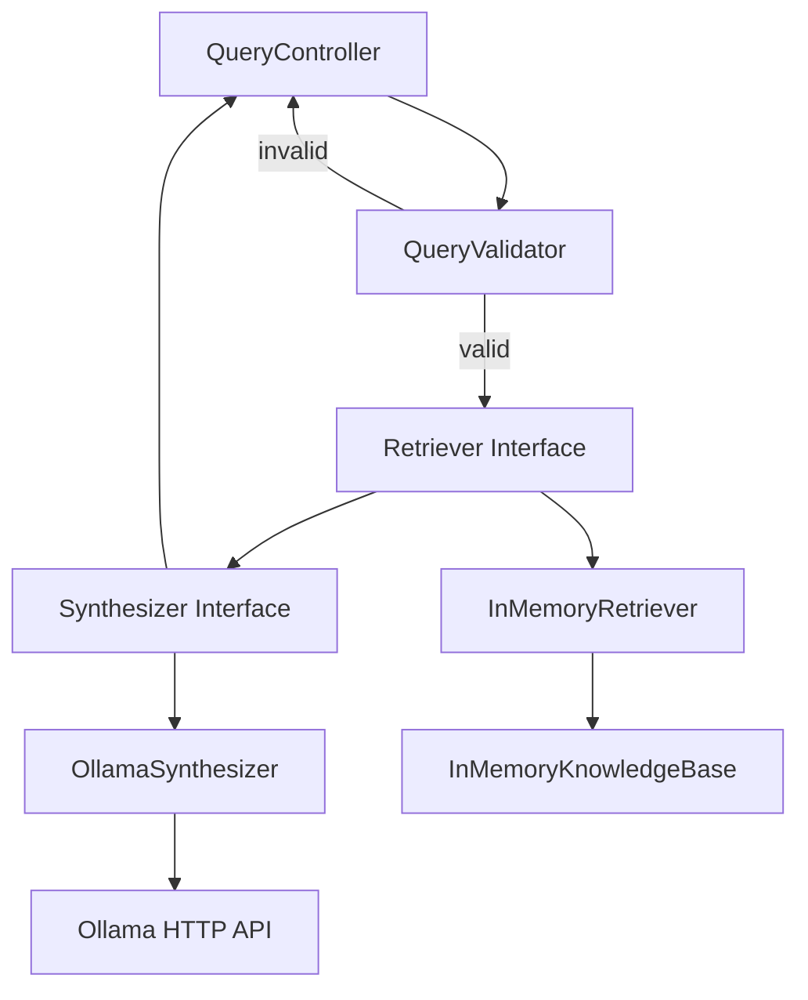

# Query API TDD Implementation Plan

## Architecture Overview

The Query API follows a pipeline architecture: **Validate → Retrieve → Synthesize → Respond**. Each component is independently testable and follows interface-based design for flexibility.



## Implementation Tasks

### Phase 1: Project Setup & Basic Configuration

**Task 1.1: Add Spring Boot Dependencies and Application Class**

- **Test**: Integration test that Spring context loads successfully with required dependencies
- **Implementation**: Update `pom.xml` with Spring Boot dependencies, convert `Main.java` to `@SpringBootApplication`
- **Verification**: Spring Boot test context loads without errors

**Task 1.2: Create Basic Application Properties (Runtime Configuration Only)**

- **Test**: Test that `application.properties` file exists and can be read by Spring Boot
- **Implementation**: Create `application.properties` with runtime configuration values only:
  - `ollama.url=http://localhost:11434` (varies by environment)
  - `ollama.model=llama3.2:1b` (might change)
  - `ollama.timeout-seconds=10` (might need tuning)
  - `query.default-max-sources=10` (implementation default, not API contract)
- **Verification**: Properties file exists with runtime configuration only
- **Note**: API contract constraints (like query max length) will be defined via OpenAPI/Swagger annotations on DTOs, not in properties. We will create `QueryApiProperties` class with `@ConfigurationProperties` later when we need runtime config (Phase 5 for Synthesizer).

### Phase 2: Data Models & DTOs

**Task 2.1: Implement Domain Models (Chunk, SynthesisResult)**

- **Test**: Test that `Chunk` and `SynthesisResult` can be created with required fields and accessed correctly
- **Implementation**: Create `Chunk` class (chunkId, documentId, documentTitle, text, url, relevanceScore) and `SynthesisResult` class (answerText, citation references)
- **Verification**: Domain models support required operations

**Task 2.2: Implement DTOs with OpenAPI Annotations (QueryRequest, QueryResponse, ErrorResponse)**

- **Test**: Integration test that DTOs serialize/deserialize correctly and OpenAPI annotations generate correct API documentation
- **Implementation**: Create DTOs with:
  - Jackson annotations for serialization
  - Bean Validation annotations for API contract constraints (`@NotNull`, `@Size(max=2000)` on query field, `@Min`/`@Max` on maxSources/maxTokens)
  - OpenAPI/Swagger annotations (`@Schema`, `@Parameter`) for API documentation
- **Verification**: DTOs work correctly in HTTP context, validation annotations enforce constraints, OpenAPI docs are generated correctly

### Phase 3: Validation Layer

**Task 3.1: Implement QueryValidator Using Bean Validation**

- **Test**: Parameterized test covering all validation cases: null query, blank query, query exceeding max length (2000), invalid maxSources range (1-50), invalid maxTokens
- **Implementation**: 
  - Create `QueryValidator` interface and `QueryValidatorImpl` that uses Bean Validation (`@Valid` on controller parameter triggers validation)
  - Validation constraints are defined via annotations on `QueryRequest` DTO (`@Size(max=2000)`, `@NotNull`, `@Min`/`@Max`)
  - Validator handles custom validation logic (trim, blank check) and maps Bean Validation errors to `ValidationResult`
- **Verification**: All validation cases return appropriate `ValidationResult` with error codes, constraints are enforced via annotations (API contract), not configuration

### Phase 4: Retrieval Layer

**Task 4.1: Implement Retriever Interface and InMemoryKnowledgeBase**

- **Test**: Test that `Retriever` interface can be mocked and `InMemoryKnowledgeBase` stores/retrieves chunks
- **Implementation**: Create `Retriever` interface and `InMemoryKnowledgeBase` class
- **Verification**: Knowledge base operations work correctly

**Task 4.2: Implement InMemoryRetriever - Complete Retrieval Logic**

- **Test**: Comprehensive test covering: empty knowledge base returns empty list, keyword matching finds relevant chunks, relevance scoring assigns scores [0,1], maxChunks limit is respected, relevance threshold (>=0.8) filters chunks, chunks are ordered by relevance
- **Implementation**: Create `InMemoryRetriever` implementing all retrieval logic in one class
- **Verification**: All retrieval behaviors work together correctly

**Task 4.3: Implement RetrievalException**

- **Test**: Test that `RetrievalException` is thrown on retrieval failures and can be caught by API layer
- **Implementation**: Create `RetrievalException` class
- **Verification**: Exception handling works correctly

### Phase 5: Synthesis Layer

**Task 5.1: Implement Synthesizer Interface**

- **Test**: Test that `Synthesizer` interface can be mocked
- **Implementation**: Create `Synthesizer` interface
- **Verification**: Interface can be used for dependency injection

**Task 5.2: Implement OllamaSynthesizer with Runtime Configuration**

- **Test**: Comprehensive test covering: prompt construction with numbered chunks, Ollama API request building, HTTP call with timeout handling, response parsing, citation extraction from answer text, `SynthesisResult` construction with citations
- **Implementation**: 
  - Create `QueryApiProperties` class with `@ConfigurationProperties(prefix = "ollama")` for runtime configuration (URL, model name, timeout)
  - Create `OllamaSynthesizer` with HTTP client, prompt building, API calls, response parsing, and citation extraction, injecting `QueryApiProperties`
- **Verification**: All synthesis behaviors work together correctly, runtime configuration is loaded from properties (these are infrastructure concerns, not API contract)

**Task 5.3: Implement SynthesisException**

- **Test**: Test that `SynthesisException` is thrown on synthesis failures (timeout, HTTP errors) and can be caught by API layer
- **Implementation**: Create `SynthesisException` class
- **Verification**: Exception handling works correctly

### Phase 6: Controller & API Layer

**Task 6.1: Implement QueryController with OpenAPI Documentation**

- **Test**: Comprehensive controller test covering: endpoint accepts POST /query, validation integration via `@Valid` (returns 400 on failure), retrieval integration (handles `RetrievalException` → 503), empty retrieval handling (returns 200 with `answerSynthesized: false`), synthesis integration (handles `SynthesisException` → 503), citation document mapping and deduplication, metadata construction, success response (200 with `QueryResponse`)
- **Implementation**: 
  - Create `QueryController` with `@RestController`, `@PostMapping("/query")`, `@Operation` for OpenAPI docs
  - Use `@Valid @RequestBody QueryRequest` to trigger Bean Validation
  - Inject `QueryApiProperties` for default maxSources (runtime config, not API contract)
- **Verification**: All controller behaviors work together correctly, OpenAPI documentation is generated correctly

### Phase 7: Integration & End-to-End

**Task 7.1: Integration Test - Happy Path**

- **Test**: End-to-end test with mocked retriever and synthesizer, verifies full pipeline executes successfully
- **Implementation**: `@SpringBootTest` with `@AutoConfigureMockMvc`, use `@MockBean` for retriever/synthesizer
- **Verification**: Full pipeline executes successfully

**Task 7.2: Integration Test - Validation Failure**

- **Test**: End-to-end test with invalid request (blank query), verifies 400 response with `VALIDATION_ERROR`
- **Implementation**: Send request with invalid data
- **Verification**: Validation error is returned correctly

**Task 7.3: Integration Test - Empty Retrieval**

- **Test**: End-to-end test with mocked retriever returning empty list, verifies 200 with `answerSynthesized: false`
- **Implementation**: Mock retriever to return empty list
- **Verification**: Empty retrieval handled gracefully

**Task 7.4: Integration Test - Retrieval Exception**

- **Test**: End-to-end test with mocked retriever throwing `RetrievalException`, verifies 503 with `RETRIEVAL_FAILED`
- **Implementation**: Mock retriever to throw exception
- **Verification**: Retrieval errors map to 503

**Task 7.5: Integration Test - Synthesis Exception**

- **Test**: End-to-end test with mocked synthesizer throwing `SynthesisException`, verifies 503 with `SYNTHESIS_FAILED`
- **Implementation**: Mock synthesizer to throw exception
- **Verification**: Synthesis errors map to 503

**Task 7.6: Integration Test - Real InMemoryRetriever with Sample Data**

- **Test**: End-to-end test using real `InMemoryRetriever` with pre-populated knowledge base, verifies retrieval and citation deduplication work correctly
- **Implementation**: Create test knowledge base with sample chunks, use real retriever implementation
- **Verification**: Real retriever finds relevant chunks, citation deduplication works

## Configuration Strategy

### Separation of Concerns

**1. API Contract Constraints** (OpenAPI/Swagger + Bean Validation):

- Query max length (2000 chars) → `@Size(max=2000)` on `QueryRequest.query`
- Required fields → `@NotNull` annotations
- Field ranges (maxSources 1-50, maxTokens positive) → `@Min`/`@Max` annotations
- **Not configurable** — these define the API contract that clients must follow
- Documented in OpenAPI/Swagger UI
- Enforced via Bean Validation

**2. Runtime Configuration** (`@ConfigurationProperties`):

- Ollama URL (varies by environment: localhost vs remote)
- Ollama model name (might change)
- Ollama timeout (might need tuning)
- Default maxSources (implementation detail, not API contract)
- These are infrastructure concerns that vary by environment

### Implementation Approach

1. **Phase 1**: Create `application.properties` with runtime configuration only
2. **Phase 2**: Add OpenAPI/Swagger annotations to DTOs for API contract documentation
3. **Phase 3**: Use Bean Validation annotations on DTOs for API contract constraints
4. **Phase 5**: Create `QueryApiProperties` with `@ConfigurationProperties` for Ollama runtime config
5. **Phase 6**: Use `QueryApiProperties` for default maxSources in controller

## Test Structure

Each task follows TDD cycle:

1. **Red**: Write failing test first
2. **Green**: Implement minimal code to make test pass
3. **Refactor**: Improve code while keeping tests green

## Key Files to Create

- `src/main/java/org/example/queryapi/QueryController.java` - REST endpoint
- `src/main/java/org/example/queryapi/dto/QueryRequest.java` - Request DTO with validation annotations
- `src/main/java/org/example/queryapi/dto/QueryResponse.java` - Response DTO
- `src/main/java/org/example/queryapi/dto/ErrorResponse.java` - Error DTO
- `src/main/java/org/example/queryapi/domain/Chunk.java` - Domain model
- `src/main/java/org/example/queryapi/domain/SynthesisResult.java` - Domain model
- `src/main/java/org/example/queryapi/validation/QueryValidator.java` - Validator interface
- `src/main/java/org/example/queryapi/validation/QueryValidatorImpl.java` - Validator implementation
- `src/main/java/org/example/queryapi/retrieval/Retriever.java` - Retriever interface
- `src/main/java/org/example/queryapi/retrieval/InMemoryRetriever.java` - In-memory implementation
- `src/main/java/org/example/queryapi/retrieval/InMemoryKnowledgeBase.java` - Knowledge base storage
- `src/main/java/org/example/queryapi/retrieval/RetrievalException.java` - Retrieval exception
- `src/main/java/org/example/queryapi/synthesis/Synthesizer.java` - Synthesizer interface
- `src/main/java/org/example/queryapi/synthesis/OllamaSynthesizer.java` - Ollama implementation
- `src/main/java/org/example/queryapi/synthesis/SynthesisException.java` - Synthesis exception
- `src/main/java/org/example/queryapi/config/QueryApiProperties.java` - Runtime configuration (Ollama only)
- `src/main/resources/application.properties` - Runtime configuration values
- Test files mirroring main structure in `src/test/java/`

## Dependencies to Add

```xml
<parent>
    <groupId>org.springframework.boot</groupId>
    <artifactId>spring-boot-starter-parent</artifactId>
    <version>3.2.2</version>
</parent>

<dependencies>
    <dependency>
        <groupId>org.springframework.boot</groupId>
        <artifactId>spring-boot-starter-web</artifactId>
    </dependency>
    <dependency>
        <groupId>org.springframework.boot</groupId>
        <artifactId>spring-boot-starter-validation</artifactId>
    </dependency>
    <dependency>
        <groupId>org.springdoc</groupId>
        <artifactId>springdoc-openapi-starter-webmvc-ui</artifactId>
        <version>2.3.0</version>
    </dependency>
    <dependency>
        <groupId>org.springframework.boot</groupId>
        <artifactId>spring-boot-starter-test</artifactId>
        <scope>test</scope>
    </dependency>
</dependencies>
```

## Removed Trivial/Duplicate Tests

**Removed trivial tests:**

- Separate JSON serialization/deserialization tests (Spring Boot handles automatically)
- Interface definition tests (just checking interface exists)
- Configuration properties for API contract constraints (now using annotations)

**Consolidated duplicate tests:**

- Combined all validation rules into one parameterized test
- Combined all retrieval logic into one comprehensive test
- Combined all synthesis logic into one comprehensive test
- Combined all controller behaviors into one comprehensive test

## Notes

- API contract constraints are defined via OpenAPI/Swagger and Bean Validation annotations (not configurable)
- Runtime configuration is externalized via properties (Ollama settings only)
- Each task is independently testable following TDD
- Interfaces allow swapping implementations
- Focus on behavior-driven tests rather than implementation details