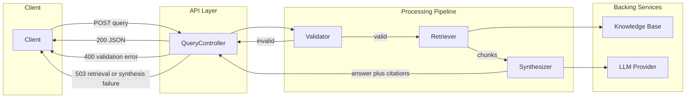

# Technical Design Document: Query API

**Document type:** Technical Design Document (TDD)  
**Source:** Derived from [PRD-QUERY-API.md](PRD-QUERY-API.md)  
**Scope:** Query capability (RAG Knowledge Garden) — implementable specification for the single query endpoint.

---

## 1. Overview & Goals

### 1.1 Problem (from PRD)

Users need answers from a curated knowledge base (the "knowledge garden") that are **traceable**: they must see which source documents support the answer. The system shall expose one API entry point that accepts a natural-language question and returns an answer grounded in retrieved content, with clear attribution to sources.

### 1.2 Goals

- **Answer questions** from the knowledge base using natural language.
- **Ground answers in retrieval** so responses are based on stored content, not general knowledge.
- **Provide traceability** by returning cited documents and mapping citation markers (e.g. `[1]`, `[2]`) in the answer to those documents.
- **Expose a simple contract:** one request (the question), one response (answer + sources + metadata).

### 1.3 Success Criteria (from PRD)

- Client submits a question and receives structured JSON with: natural-language answer (with inline citations), set of cited documents, and execution metadata.
- Invalid or missing input (blank or over-length query) is rejected with clear validation behavior (e.g. HTTP 400 + structured error body).
- Flow is consistent: validate input → retrieve relevant chunks → synthesize answer with citations → return response.

### 1.4 Non-Goals

- **Ingestion pipeline:** How documents are added to the knowledge base is out of scope; this TDD assumes a populated store.
- **Authentication/authorization:** To be added later; not designed here.
- **Rate limiting and horizontal scaling:** Noted for future work; no detailed design.
- **Exact prompt wording:** Only prompt structure and expectations are specified; full template text is left to implementation.

---

## 2. System Architecture

The Query API is a single HTTP endpoint that orchestrates validation, retrieval, and synthesis. The following diagram shows the happy path and failure paths.



**Happy path:** Client → API → Validator (pass) → Retriever → Synthesizer → API → 200 + JSON response.

**Failure paths:**

- **Validation failure:** Validator rejects input (e.g. blank or over-length query) → API returns 400 with structured error body.
- **Retrieval empty or failure:** Retriever returns no chunks or throws → API returns 503 or 200 with `answerSynthesized: false` and empty/minimal answer per product decision (see Error handling).
- **Synthesis failure:** LLM timeout (exceeding the 10-second Ollama call timeout) or error → API returns 503 with structured error body (with `error = "SYNTHESIS_FAILED"`).

---

## 3. API Contract

### 3.1 Endpoint

| Attribute | Value |
|-----------|--------|
| Method | `POST` |
| Path | `/query` |
| Request body | JSON |
| Response body | JSON |
| Content-Type | `application/json` |

### 3.2 Request Schema

| Field | Type | Required | Description |
|-------|------|----------|-------------|
| `query` | string | Yes | Natural-language question. Must be non-blank and within max length (see Validation). |
| `maxSources` | integer | No | Max number of document chunks to use for synthesis (default: e.g. 10). |
| `maxTokens` | integer | No | Max tokens for the generated answer (default: provider-specific). |

Example:

```json
{
  "query": "What is the recommended deployment topology?",
  "maxSources": 5
}
```

### 3.3 Response Schema (Success)

| Field | Type | Description |
|-------|------|-------------|
| `answer` | string | Natural-language answer with inline citation markers `[1]`, `[2]`, etc. |
| `citedDocuments` | array | List of cited sources in order of first citation appearance (see Data models). |
| `metadata` | object | Execution metadata (see below). |

**metadata:**

| Field | Type | Description |
|-------|------|-------------|
| `processingTimeMs` | number | Total time from request receipt to response (milliseconds), including retrieval and LLM synthesis; may approach the 10-second LLM timeout under load. |
| `answerSynthesized` | boolean | `true` if an answer was generated; `false` if no chunks (including all candidates falling below the relevance threshold) or synthesis was skipped. |
| `chunksRetrieved` | integer | Number of chunks returned by retrieval (before any filtering by relevance threshold). |

Example:

```json
{
  "answer": "The recommended topology is active-passive [1]. Each node runs the same version [2].",
  "citedDocuments": [
    { "id": "doc-1", "title": "Deployment Guide", "snippet": "...", "url": null },
    { "id": "doc-2", "title": "Node Configuration", "snippet": "...", "url": null }
  ],
  "metadata": {
    "processingTimeMs": 1250,
    "answerSynthesized": true,
    "chunksRetrieved": 5
  }
}
```

### 3.4 HTTP Status Codes

| Code | Meaning |
|------|---------|
| 200 | Success. Body contains answer (possibly empty if no chunks or all candidates are below the relevance threshold), citedDocuments, and metadata. |
| 400 | Validation error (e.g. missing or blank query, query over max length). Body is structured error (see Error handling). |
| 503 | Server-side failure (retrieval or synthesis error, including LLM timeout). Body is structured error. |

---

## 4. Processing Pipeline

The pipeline runs in order; any step can short-circuit to an error response.

1. **Validate input:** Check `query` is present, non-blank after trim, and length ≤ max (e.g. 2000 characters). If invalid → 400.
2. **Retrieve:** Call retriever with `query` and `maxSources` (or default). Retrieve by relevance and assign a normalized relevance score in \[0, 1] to each candidate (e.g. semantic similarity). If retrieval fails (exception) → 503. After applying the relevance threshold (score `< 0.8`), if zero chunks remain, **always** return 200 with `answerSynthesized: false` and an appropriate "no answer" style message so clients can distinguish "no content" (including low-relevance results) from "system error."
3. **Synthesize:** Pass question + the filtered chunks (score `>= 0.8`) to the synthesizer. The LLM call to Ollama is wrapped in a 10-second timeout. The model produces an answer with `[1]`…`[n]` markers. Build `citedDocuments` from the chunks actually referenced. If synthesis fails (timeout past 10 seconds, API error) → 503 with `error = "SYNTHESIS_FAILED"`.
4. **Respond:** Set `metadata.processingTimeMs`, `metadata.answerSynthesized`, `metadata.chunksRetrieved`. Return 200 with JSON body.

---

## 5. Data Models

### 5.1 Request DTO

- **QueryRequest:** `query` (String), `maxSources` (Integer, optional), `maxTokens` (Integer, optional).

### 5.2 Response DTOs

- **QueryResponse:** `answer` (String), `citedDocuments` (List<CitedDocument>), `metadata` (ResponseMetadata).
- **CitedDocument:** `id` (String), `title` (String), `snippet` (String — chunk text or summary), `url` (String, optional/null). Each instance represents a **single source document**; if multiple chunks from the same document were used, they are merged into one `CitedDocument` entry.
- **ResponseMetadata:** `processingTimeMs` (long), `answerSynthesized` (boolean), `chunksRetrieved` (int).

### 5.3 Domain / Internal Types

- **Chunk:** Represents one retrieved segment: `chunkId`, `documentId`, `documentTitle`, `text`, optional `url`. Used by Retriever and Synthesizer.
- **SynthesisResult:** Internal output of synthesizer: `answerText` (with citation markers), ordered list of chunk references (e.g. by index) that correspond to `[1]`, `[2]`, etc.

---

## 6. Retrieval Design

### 6.1 Knowledge Base Model

- The knowledge base is a set of **documents**, each split into **chunks** (e.g. by paragraph or fixed token size).
- Each chunk has: stable id, document id, document title, text content, optional URL.
- Chunks are retrieved **by relevance** to the query (e.g. semantic similarity via embeddings + vector search, or keyword match for MVP).
- **Current backing store (MVP):** In-memory collection of `Chunk` instances held in-process, suitable for a single-node or local deployment.
- **Elasticity:** The backing store is intentionally hidden behind the `Retriever` abstraction so that migrating to a file-based or vector-database-backed store does not require changes to the controller, API contract, or synthesizer.

### 6.2 Retrieval Interface

Implement a **Retriever** interface so the backing store can be swapped (in-memory, file-based, or vector DB).

**Contract:**

- **Input:** `query` (String), `maxChunks` (int).
- **Output:** Ordered list of `Chunk` (most relevant first). Empty list if no matches.
- **Exceptions:** Implementation may throw on store/network errors; API layer maps to 503.

Example (Java-style):

```text
List<Chunk> retrieve(String query, int maxChunks);
```

### 6.3 Retrieval Strategy

- **Scoring and ranking:** Retrieval assigns each candidate chunk a normalized relevance score in \[0, 1] (e.g. cosine similarity between query embedding and chunk embedding) and returns candidates ranked from highest to lowest.
- **Relevance threshold for synthesis:** Only chunks with score `>= 0.8` (corresponding to 80/100) are eligible to be passed to the synthesizer. Implementations may first collect the top-N candidates and then apply this threshold.
- **No-chunk behavior with low scores:** If all retrieved candidates fall below the relevance threshold, treat this as "no chunks" and follow the pipeline rule in section 4 (return 200 with `answerSynthesized: false` and a "no answer" style message).
- **Deduplication:** If multiple chunks come from the same document, they may all appear in the internal `Chunk` list, but **`citedDocuments` MUST have only one entry per source document**. When constructing `citedDocuments`, group by document id and order the entries by the first time any chunk from that document is cited in the answer.

---

## 7. Synthesis Design

### 7.1 Contract

- **Input:** User `query` (String), ordered list of `Chunk` from retrieval. Chunks are numbered 1..n for citation markers.
- **Output:** Answer text with inline markers `[1]`…`[n]` referencing those chunks, plus mapping of which chunk indices were used (to build `citedDocuments` in order of first appearance in the answer).

### 7.2 LLM and Prompt Expectations

- **Provider:** Use a **local Ollama small-memory model**, standardized as `llama3.2:1b`, running on the same host. The application calls the local Ollama HTTP API (default `http://localhost:11434`) instead of a remote cloud provider.
- **Prompt structure:**
  - System/instruction: Instruct the model to answer only using the provided context chunks, and to cite each claim with `[k]` where k is the 1-based chunk number.
  - User message: Include the query and the numbered chunks (e.g. "Chunk 1: …", "Chunk 2: …", then "Question: …").
- **Model configuration:**
  - Default model name is `llama3.2:1b`, suitable for constrained environments (e.g. low VRAM/RAM), and is configured via external properties (model name, temperature, max tokens).
  - The synthesizer component is responsible for constructing the Ollama request payload (prompt text, model name, generation parameters) and handling streaming or non-streaming responses.
- **Timeout configuration:** The HTTP call from the synthesizer to Ollama is wrapped in a **10-second timeout**, configured via application properties. Timeouts are surfaced as synthesis failures to the API layer.
- **Output:** Parse the Ollama response to extract the model reply as the answer text; extract cited indices from the markers and map them to document ids to build the ordered `citedDocuments` list (one entry per document, ordered by first citation in the answer).
- **Interface:** Define a **Synthesizer** interface (e.g. `SynthesisResult synthesize(String query, List<Chunk> chunks)`) so the underlying LLM provider can still be swapped (e.g. a different Ollama model or a remote endpoint) without changing the pipeline.

### 7.3 Failure Handling

- Timeout exceeding the 10-second Ollama call timeout or other API error → throw or return a failure result; API layer returns 503 with `error = "SYNTHESIS_FAILED"` in the structured error body.

---

## 8. Technology Choices

| Component | Recommendation | Rationale |
|-----------|----------------|-----------|
| **Web framework** | Spring Boot (Spring Web) | Standard for Java REST APIs; includes Jackson for JSON, easy to add validation and error handling. |
| **Java** | 21 | Already in use; no change. |
| **Retrieval (MVP)** | In-memory collection of `Chunk` instances behind a `Retriever` implementation; interface supports `List<Chunk> retrieve(String, int)`. | Fast to implement for a single-node/local deployment; no extra infrastructure while preserving a clear seam for swapping storage. |
| **Retrieval (future)** | Vector DB (e.g. pgvector, Chroma) + embedding API (e.g. OpenAI embeddings or locally hosted embeddings via Ollama or similar). Same `Retriever` interface. | Enables semantic search; TDD recommends this for production. Migrating from the in-memory MVP primarily involves changing the `Retriever` implementation and storage layer, not the controller or public API. |
| **LLM** | Local Ollama small-memory model `llama3.2:1b` accessed via the Ollama HTTP API on `localhost`. | Removes external cloud dependency; runs entirely on local hardware. Implement behind `Synthesizer` interface for swapability. |
| **JSON** | Jackson (included with Spring) | No additional dependency. |

**Dependencies to add (for implementation):** Spring Boot starter web; optional validation starter (e.g. `spring-boot-starter-validation`) for request validation. No code or `pom.xml` changes are part of this TDD artifact—only the specification.

---

## 9. Error Handling & Validation

### 9.1 Validation Rules

- **query:** Required, non-blank after trim. Max length: 2000 characters (configurable). Violation → 400.
- **maxSources:** If present, must be positive integer (e.g. 1–50). Violation → 400.
- **maxTokens:** If present, must be positive integer within provider limits. Violation → 400.

### 9.2 Structured Error Response Body

Use a consistent JSON shape for 400 and 503:

| Field | Type | Description |
|-------|------|-------------|
| `error` | string | Short code (e.g. `VALIDATION_ERROR`, `RETRIEVAL_FAILED`, `SYNTHESIS_FAILED`). |
| `message` | string | Human-readable description. |
| `details` | object (optional) | E.g. `field` for validation errors, or empty. |

- For retrieval failures, use `error = "RETRIEVAL_FAILED"`.
- For synthesis failures (including Ollama calls exceeding the 10-second timeout), use `error = "SYNTHESIS_FAILED"`.

Example (400):

```json
{
  "error": "VALIDATION_ERROR",
  "message": "Query must be non-blank and at most 2000 characters.",
  "details": { "field": "query" }
}
```

### 9.3 Idempotency

Not required for this version. POST is non-idempotent; repeated same query may return different answers if the knowledge base or model changes.

---

## 10. Security, Observability, Future Work

### 10.1 Security

- **Authentication/authorization:** Not in scope; to be added later (e.g. API key or OAuth). Design should not preclude adding a filter or interceptor.
- **API key for LLM:** Stored in environment or secret store; never in source code or logs.
- **Input:** Validate and bound query length to mitigate abuse; no execution of user input as code.

### 10.2 Observability

- **Logging:** Log request id (if available), validation failures, retrieval/synthesis failures, and response status. Do not log full query or answer content in production if they are sensitive.
- **Metrics:** Optional: request count, latency histogram, error count by type. Left to implementation.

### 10.3 Future Work

- **Ingestion pipeline:** Design for how documents are chunked, embedded, and stored.
- **Rate limiting:** Per-client or per-user limits to be added when auth is in place.
- **Scaling:** Stateless API; horizontal scaling behind a load balancer. Retrieval and LLM are external dependencies that may need their own scaling.
